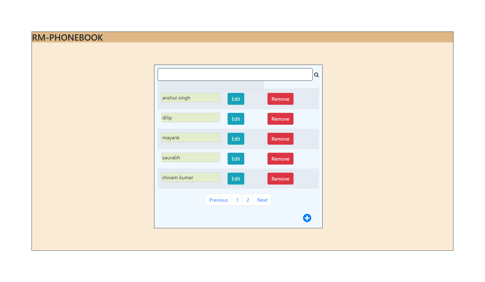
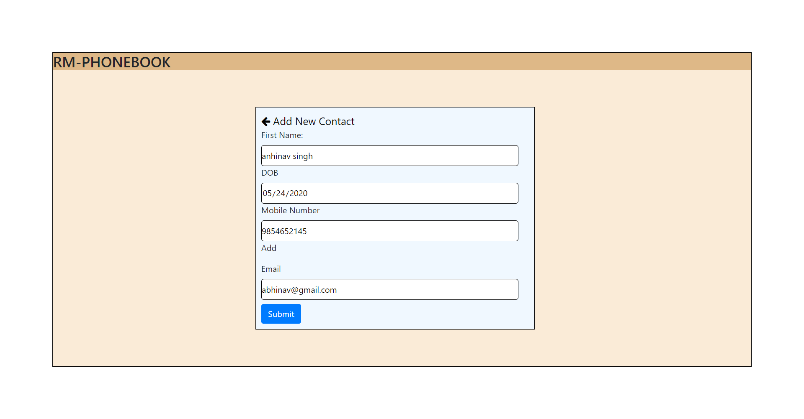
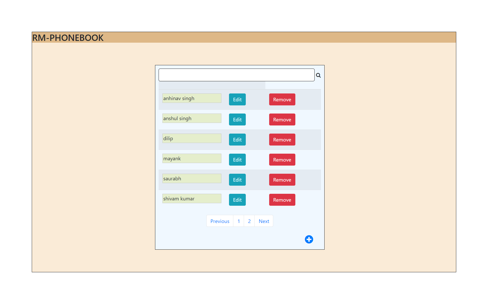
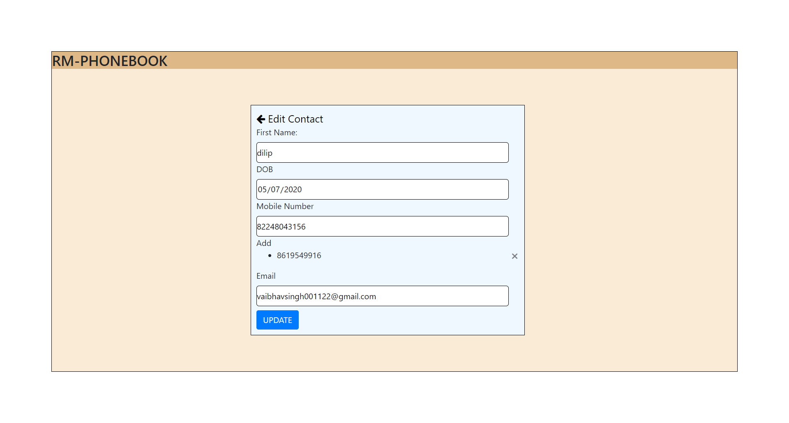
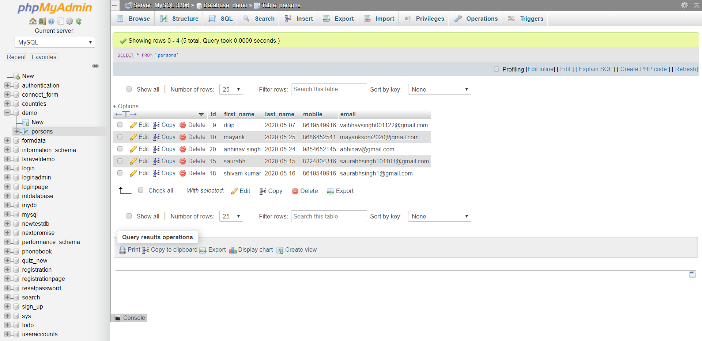

# Rentomojo-Assignment
phone book web app
### Technologies are used in this project :- HTML5 + CSS3 + MySql + PHP + Javascript + jQuery.

### 1. HomePage

##### this is the homepage.

### 2. Add New Contact

##### if you are added the new contact number then data stored in database and display data in home page.

### 3. After the submit data in database data are display in home page.

### 4. Edit page 

##### if you are currecting aur detail then click edit button and edit your data.

### 5. Database

##### All the data stored in a database.

## Thank You !!!

